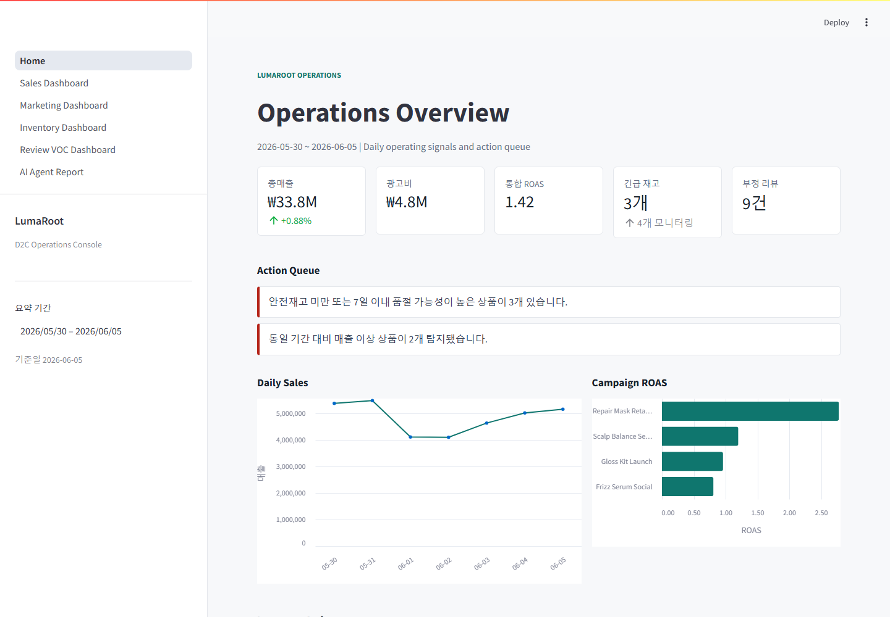
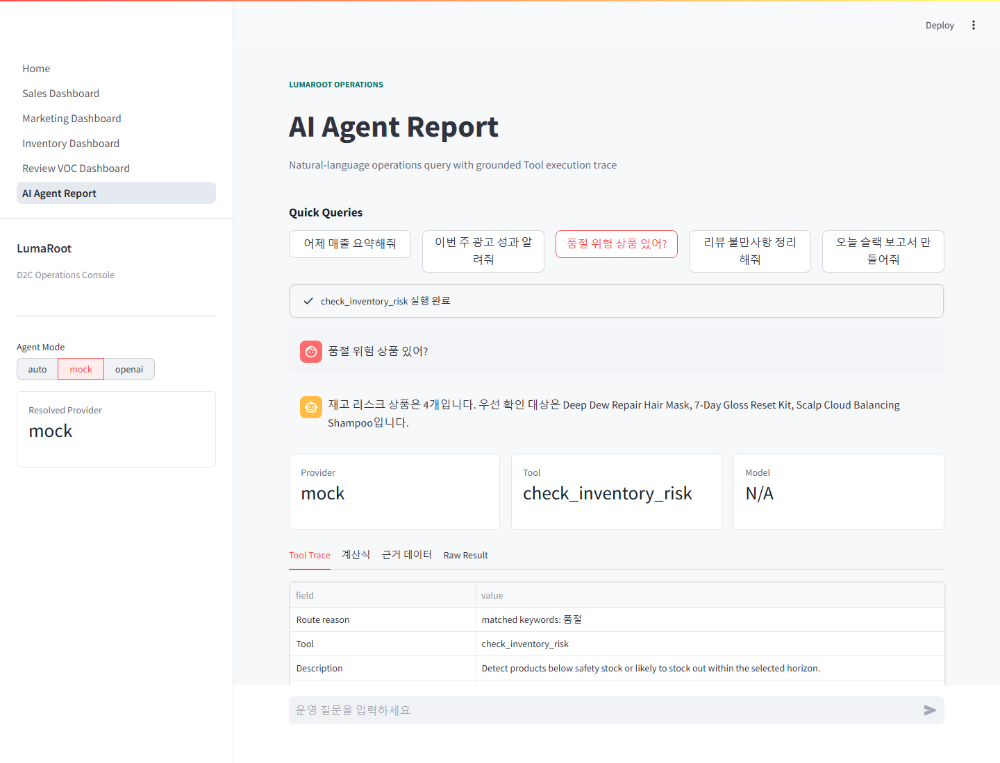

# D2C Brand Operations AI Agent

[](https://github.com/RohKJ/person-ai-project/actions/workflows/ci.yml)

이 프로젝트는 **D2C 브랜드 운영자가 매일 반복하는 매출·광고·재고·고객 반응 분석을 자동화하는 AI Agent 포트폴리오 프로젝트**입니다.

일반적인 챗봇처럼 숫자를 추측해서 답하지 않습니다. 사용자의 자연어 질문을 적절한 분석 Tool로 연결하고, SQL/Pandas가 계산한 결과와 계산식, 근거 데이터를 함께 보여줍니다. OpenAI API Key가 없어도 Mock Agent 모드로 전체 기능을 실행할 수 있습니다.



## 이 프로젝트가 하는 일

가상의 헤어케어 D2C 브랜드 데이터를 기반으로 아래 운영 업무를 한 화면에서 처리합니다.

- 어제 매출과 전일 대비 증감률 확인
- 캠페인별 ROAS, CTR, CVR 분석
- 판매 속도 기반 재고 소진 예상일과 품절 위험 탐지
- 리뷰와 CS 메시지의 주요 불만 키워드 요약
- 매출 급등·급락 상품 탐지
- 분석 결과를 근거로 Slack 운영 보고서 작성
- 자연어 질문을 분석 함수로 연결하고 Tool 실행 이력 표시

예를 들어 사용자가 `품절 위험 상품 있어?`라고 질문하면 Agent는 `check_inventory_risk` Tool을 호출합니다. 답변에 표시되는 재고 수량과 소진 예상일은 LLM이 생성한 숫자가 아니라 분석 함수가 SQLite 데이터를 이용해 계산한 값입니다.



## 문제 정의

D2C 브랜드 운영자는 주문, 광고, 재고, 리뷰, CS 데이터를 매일 확인하고 같은 형태의 보고서를 반복해서 작성합니다. 이 과정은 시간이 오래 걸리고, 서로 다른 데이터의 숫자를 잘못 옮길 위험도 있습니다.

이 프로젝트는 다음 원칙으로 반복 업무를 줄입니다.

- 분석 계산은 재현 가능한 SQL/Pandas 함수가 담당합니다.
- Agent는 질문에 맞는 Tool과 입력값을 선택합니다.
- 모든 핵심 결과는 `formula`와 `evidence`를 함께 반환합니다.
- Mock Provider와 OpenAI Provider가 같은 Tool Registry를 사용합니다.

## 시스템 아키텍처

```text
Sample CSV Generator
        |
        v
    SQLite DB
        |
        v
SQL/Pandas Analysis Tools <---- Pydantic Tool Schemas
        |                              |
        +-------- Tool Registry -------+
                       |
              Agent Service / Provider
                |                 |
          Rule-based Mock     OpenAI Responses API
                \                 /
                 FastAPI + Streamlit
```

주요 구조:

```text
app/
├── agent/              # Provider, Router, Tool Registry, schemas, formatter
├── analysis/           # 매출, 광고, 재고, 리뷰, 보고서 분석 함수
├── api/                # FastAPI endpoints
├── core/               # 환경 설정과 DB 연결
└── models/             # SQLAlchemy table models
dashboard/
├── Home.py             # 운영 KPI와 Action Queue
└── pages/              # 매출, 마케팅, 재고, VOC, Agent 화면
scripts/
├── generate_sample_data.py
├── init_db.py
├── evaluate_agent.py
└── dev.ps1
tests/                  # 분석, Agent, API, Dashboard 테스트
```

## 기술 스택

- Backend: Python 3.11, FastAPI, Pydantic
- Data: SQLite, SQLAlchemy, Pandas
- Agent: Rule-based Mock Provider, OpenAI Responses API Tool Calling
- Frontend: Streamlit
- Quality: pytest, GitHub Actions
- Runtime: Docker, Docker Compose

## 빠른 실행

### Docker Compose

Docker가 설치되어 있다면 한 명령으로 샘플 데이터 생성, DB 초기화, API, Dashboard를 실행할 수 있습니다.
기본 Compose 실행은 비밀값을 주입하지 않는 Mock Agent 모드입니다.

```bash
docker compose up --build
```

- Streamlit Dashboard: http://localhost:8501
- FastAPI Swagger: http://localhost:8000/docs
- Health Check: http://localhost:8000/health

종료:

```bash
docker compose down
```

샘플 데이터와 SQLite 볼륨까지 초기화:

```bash
docker compose down -v
```

Windows의 한글 경로에서 Docker Desktop BuildKit 인코딩 오류가 발생하면 아래 호환 명령을 사용할 수 있습니다.

```powershell
$env:DOCKER_BUILDKIT=0
docker build -t person-ai-project:local .
docker compose up --no-build
```

### 로컬 Python

```bash
pip install -r requirements.txt
python scripts/generate_sample_data.py
python scripts/init_db.py
uvicorn app.main:app --reload
```

다른 터미널에서 Dashboard를 실행합니다.

```bash
streamlit run dashboard/Home.py
```

Windows PowerShell에서는 준비와 검증을 한 번에 실행할 수 있습니다.

```powershell
powershell -ExecutionPolicy Bypass -File scripts/dev.ps1 all
```

## Agent 모드

`.env.example`을 참고해 환경 변수를 설정합니다.

```dotenv
AGENT_MODE=auto
OPENAI_MODEL=gpt-5.4-mini
# OPENAI_API_KEY=
```

| `AGENT_MODE` | 동작 |
| --- | --- |
| `auto` | API Key가 있으면 OpenAI, 없으면 Mock Provider 사용 |
| `mock` | 항상 rule-based Router 사용 |
| `openai` | OpenAI Responses API 사용. API Key가 없으면 명확한 오류 반환 |

OpenAI 모드에서도 모델은 Tool 이름과 입력 인자만 선택합니다. 최종 답변의 수치, 계산식, 근거 데이터는 Tool 실행 결과를 deterministic formatter가 구성합니다.

### Agent Tool 목록

- `get_daily_sales_summary(date)`
- `get_campaign_performance(start_date, end_date)`
- `detect_sales_anomaly(start_date, end_date, threshold_pct=40.0)`
- `check_inventory_risk(days=7)`
- `summarize_reviews(start_date, end_date)`
- `generate_slack_report(report_type, date, start_date, end_date)`

질문 예시:

```text
어제 매출 요약해줘
이번 주 광고 성과 알려줘
매출 급락 상품 찾아줘
품절 위험 상품 있어?
리뷰 불만사항 정리해줘
오늘 슬랙 보고서 만들어줘
```

## Agent Evaluation

Agent 품질은 사람이 눈으로만 확인하지 않고, 평가 데이터셋으로 자동 측정합니다.

```bash
python scripts/evaluate_agent.py
```

평가 케이스는 [`data/evals/agent_eval_cases.jsonl`](data/evals/agent_eval_cases.jsonl)에 있습니다. 각 케이스는 사용자 질문, 기대 Tool, 기대 인자, 반드시 포함되어야 하는 근거 경로를 정의합니다.

현재 측정 지표:

| Metric | 의미 |
| --- | --- |
| `tool_accuracy` | 자연어 질문에서 기대한 Tool을 선택했는지 |
| `argument_accuracy` | `오늘`, `어제`, `이번 주`, `14일` 같은 날짜와 기간 인자를 올바르게 만들었는지 |
| `grounding_coverage` | 응답 결과에 `formula`, `evidence`, 핵심 metric이 포함됐는지 |
| `overall_pass_rate` | Tool, 인자, 근거 조건을 모두 만족한 케이스 비율 |

최근 평가 결과는 [`docs/agent_eval_report.md`](docs/agent_eval_report.md)에 저장됩니다.

## 데이터 구조

실제 회사 데이터 대신 스크립트가 생성한 가상 헤어케어 브랜드 데이터를 사용합니다.

| 파일 | 설명 | 주요 컬럼 |
| --- | --- | --- |
| `products.csv` | 상품 마스터 | `product_id`, `product_name`, `brand`, `category`, `price` |
| `orders.csv` | 주문과 매출 | `order_id`, `order_date`, `product_id`, `channel`, `quantity`, `sales_amount`, `discount_amount` |
| `ads.csv` | 광고 성과 | `ad_date`, `campaign_id`, `spend`, `clicks`, `conversions`, `attributed_sales` |
| `inventory.csv` | 일별 재고 | `inventory_date`, `product_id`, `stock_quantity`, `safety_stock` |
| `reviews.csv` | 상품 리뷰 | `review_id`, `review_date`, `product_id`, `rating`, `review_text` |
| `cs_messages.csv` | 고객 문의와 VOC | `message_id`, `message_date`, `product_id`, `category`, `message`, `status` |

## 주요 분석 기능

| 기능 | 계산과 결과 |
| --- | --- |
| 일별 매출 요약 | 총매출, 주문 수, 판매 수량, 전일 대비 증감률 |
| 광고 성과 | 캠페인별 광고비, 클릭, 전환, 기여 매출, ROAS, CTR, CVR |
| 매출 이상 탐지 | 최근 기간과 직전 동일 기간의 상품별 매출 비교 |
| 재고 위험 | 최근 N일 평균 판매량으로 예상 소진일 계산 |
| 리뷰/VOC 요약 | 평균 평점, 부정 리뷰 수, 룰 기반 불만 키워드 |
| Slack 보고서 | 분석 결과를 운영 보고 문안으로 변환 |

## API 문서

FastAPI 실행 후 Swagger UI에서 직접 요청을 테스트할 수 있습니다.

```text
http://127.0.0.1:8000/docs
```

| Method | Path | 설명 |
| --- | --- | --- |
| `GET` | `/health` | 서버와 DB 상태 확인 |
| `GET` | `/sales/daily` | 일별 매출 요약 |
| `GET` | `/sales/anomaly` | 매출 이상 탐지 |
| `GET` | `/ads/performance` | 캠페인 성과 |
| `GET` | `/inventory/risk` | 재고 위험 상품 |
| `GET` | `/reviews/summary` | 리뷰/VOC 요약 |
| `GET` | `/agent/tools` | Tool Registry와 strict schema 조회 |
| `GET` | `/agent/status` | 요청 모드, 실제 Provider, API Key 설정 상태 |
| `POST` | `/agent/query` | 자연어 질문 기반 Agent 실행 |

Agent 요청 예시:

```bash
curl -X POST http://127.0.0.1:8000/agent/query \
  -H "Content-Type: application/json" \
  -d '{"query":"오늘 슬랙 보고서 만들어줘","mode":"mock"}'
```

## Dashboard 화면

- **Home**: 최신 KPI, 운영 이슈 Action Queue, 매출과 ROAS 추이
- **Sales Dashboard**: 일별·상품별 매출과 기간 비교 이상 탐지
- **Marketing Dashboard**: 캠페인별 예산, ROAS, CTR, CVR, CPA
- **Inventory Dashboard**: 현재 재고, 예상 소진일, 권장 발주량
- **Review/VOC Dashboard**: 평균 평점, 부정 리뷰, 키워드, 미해결 CS
- **AI Agent Report**: 자연어 질문, Provider/Tool trace, 계산식, 근거 데이터

## 테스트와 CI

```bash
pytest
```

Agent 평가까지 실행하려면 아래 명령을 사용합니다.

```bash
python scripts/evaluate_agent.py
```

현재 테스트는 핵심 계산식과 실행 경로를 검증합니다.

- ROAS, CTR, CVR 계산
- 전일 대비 매출 증감률
- 재고 소진 예상일
- Agent Router와 Provider 선택
- Agent 평가 데이터셋 통과 여부
- FastAPI endpoint
- Streamlit page import

GitHub Actions는 `main` 브랜치 push와 pull request마다 다음을 자동 실행합니다.

1. Python 3.11 의존성 설치
2. 샘플 CSV 생성과 SQLite 초기화
3. Python compile 검사와 pytest
4. Agent Evaluation 실행
5. Docker image build

## Prompt Test & Learn

프롬프트와 Router 실험 기록은 [`docs/prompt_test_learn.md`](docs/prompt_test_learn.md)에서 관리합니다.

주요 관찰 대상:

- `오늘`, `어제`, `이번 주`와 같은 상대 날짜 해석
- 비슷한 표현에서 올바른 Tool을 선택하는지
- Tool 인자가 유효한 날짜와 범위를 사용하는지
- 보고서가 계산 결과를 왜곡하지 않는지
- 평가 데이터셋의 `tool_accuracy`, `argument_accuracy`, `grounding_coverage`가 유지되는지
- 실패 시 사용자에게 이해 가능한 오류를 제공하는지

## 한계점과 향후 개선

현재 MVP의 한계:

- 로컬 샘플 데이터와 SQLite만 사용합니다.
- 리뷰 요약은 키워드 규칙 기반입니다.
- 이상 탐지는 단순 기간 비교 threshold 방식입니다.
- 실제 광고, 커머스, 재고 시스템 API와 연결하지 않았습니다.
- 인증, 권한 관리, Slack Webhook 전송은 포함하지 않았습니다.

다음 확장 방향:

- LangGraph 기반 상태 그래프와 다단계 Agent workflow
- 광고·주문·재고 외부 API Connector
- Embedding과 clustering 기반 VOC 분석
- Slack Webhook 전송과 승인 workflow
- Cloud DB, 인증, 관측성, 배포 파이프라인

## Portfolio Highlights

이 저장소에서 확인할 수 있는 역량은 다음과 같습니다.

- 데이터 생성부터 적재, 분석까지 이어지는 Python 데이터 파이프라인
- SQL/Pandas 기반의 재현 가능한 비즈니스 지표 계산
- Pydantic strict schema와 Tool Registry를 이용한 Agent Tool Calling
- LLM 없이도 테스트 가능한 Provider 추상화
- Agent Evaluation 데이터셋과 자동 품질 지표
- FastAPI와 Streamlit을 공유 도메인 로직 위에 구성한 풀스택 구조
- pytest, GitHub Actions, Docker Compose를 통한 실행과 검증 자동화
